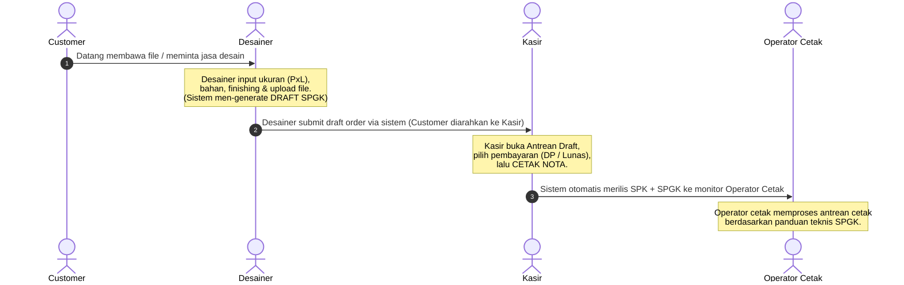

# Order & Transaction Planning - Digital Printing ERP

Dokumen ini mendokumentasikan hasil brainstorming dan arsitektur alur transaksi percetakan (*General Printing*) yang dirancang khusus untuk memenuhi kebutuhan operasional toko cetak fisik dengan pemisahan tugas yang aman dan efisien.

## 📌 Alur Utama Operasional Toko (Operational Flow)

Operasional toko fisik menggunakan alur kerja sekuensial dari meja depan hingga workshop belakang:



---

## 👥 Pemisahan Peran & Tanggung Jawab (Separation of Duties)

Untuk meningkatkan efisiensi dan keamanan transaksi dari tindakan fraud, hak akses dan tampilan layar dibagi dengan ketat:

### 1. Peran Desainer (Job Entry)
*   **Fokus Kerja**: Memeriksa kelayakan file pelanggan, menyesuaikan ukuran cetak, menentukan spesifikasi bahan, finishing, dan catatan teknis produksi melalui menu khusus bernama **"Job Entry"**.
*   **Tampilan Layar (Menu Job Entry)**:
    *   Form order input teknis: Nama Customer, Kategori/Produk, Dimensi (Panjang & Lebar dalam cm jika UoM `m2` atau `m_lari`), Qty, Opsi Finishing, Catatan Produksi, dan Kolom Link File Cetak.
    *   **STRICT**: **Layar Desainer sama sekali tidak menampilkan harga (Harga Satuan, Subtotal, maupun Total Harga)**. Hal ini dilakukan agar desainer bisa fokus penuh pada aspek teknis tanpa terganggu negosiasi harga.
*   **Penyimpanan**: Selagi proses menyusun pesanan (drafting), data keranjang disimpan di **Local Storage PC masing-masing desainer**.

### 2. Peran Kasir (Billing & Payment Processor)
*   **Fokus Kerja**: Memverifikasi antrean pesanan dari desainer, memproses pembayaran (tunai, transfer, DP, atau tempo/piutang), mencetak Nota/Invoice fisik, dan merilis instruksi kerja ke bagian produksi.
*   **Tampilan Layar**:
    *   Dashboard POS Kasir yang memuat daftar antrean transaksi berstatus `PENDING_PAYMENT` (Draft yang di-submit desainer).
    *   Kalkulator harga otomatis (*Pricing Engine*) yang langsung menjumlahkan harga satuan berdasarkan level pelanggan, diskon bertingkat (Tier Pricing), dan biaya tambahan finishing.
    *   Fitur pembayaran (Input Nominal Pembayaran, DP, Cetak Nota).

### 3. Peran Operator Cetak (Production Workspace)
*   **Fokus Kerja**: Memproduksi pesanan cetak sesuai antrean mesin secara presisi.
*   **Tampilan Layar**:
    *   Dashboard antrean Surat Perintah Kerja (SPK) yang diurutkan berdasarkan prioritas dan jenis mesin.
    *   Gambar Kerja (SPGK) visual beserta catatan teknis dari desainer agar tidak salah saat mencetak/finishing.

---

## 💾 Konsep Penyimpanan Data & Manajemen Status (State Strategy)

Untuk mendukung operasional multi-designer (lebih dari 1 desainer bekerja secara bersamaan dengan PC masing-masing) dan pergantian shift desainer, strategi penyimpanan data dirancang secara hybrid:

### 1. Active Cart Draft (Sebelum Submit) -> **Local Storage**
*   Saat desainer sedang memformulasikan pesanan bersama pelanggan di komputernya, data disimpan ke dalam **Local Storage Browser**.
*   **Alasan**:
    *   Sangat cepat dan responsif (tanpa delay jaringan server).
    *   Masing-masing desainer memiliki PC tetap, sehingga *Local Storage* otomatis terisolasi per desainer dan tidak akan bentrok satu sama lain.
    *   Berfungsi sebagai *auto-save* jika browser tidak sengaja tertutup atau komputer crash.

### 2. Submitted Order Draft (Setelah Submit) -> **Database PostgreSQL**
*   Setelah spesifikasi order dinilai lengkap, desainer mengklik tombol **"Kirim ke Kasir"**.
*   Pada titik ini, data keranjang di Local Storage desainer dibersihkan, dan pesanan disimpan ke database backend dengan status `PENDING_PAYMENT`.
*   Data ini kini dapat diakses oleh komputer Kasir secara real-time.

### 🔄 Siklus Transaksi & Transisi Status (Lifecycle Status)

| Status | Lokasi Penyimpanan | Keterangan |
| :--- | :--- | :--- |
| **`PENDING`** | Local Storage desainer | Sedang disusun oleh desainer (keranjang aktif), belum tampak di kasir maupun produksi. |
| **`PENDING_PAYMENT`** | Database | Sudah di-submit desainer, muncul di antrean pembayaran kasir. |
| **`IN_PRODUCTION`** | Database | Pembayaran DP/Lunas tervalidasi kasir, SPK rilis ke monitor operator cetak. |
| **`READY_FOR_PICKUP`** | Database | Selesai diproduksi & lolos Quality Control, siap diambil customer/dikirim. |
| **`COMPLETED`** | Database | Barang sudah diterima customer dan pembayaran sudah lunas 100%. |

---

## 📖 Klarifikasi Istilah Teknis

*   **SPK (Surat Perintah Kerja)**: Dokumen perintah dari sistem ke bagian workshop percetakan untuk memproses pesanan tertentu setelah divalidasi oleh pembayaran di kasir.
*   **SPGK (Surat Perintah & Gambar Kerja)**: Dokumen instruksi teknis cetak yang menyertakan **preview visual tata letak (gambar kerja)**, batas potong aman (*bleed*), letak finishing mata ayam/laminasi, bertujuan mutlak agar operator tidak salah melakukan eksekusi cetak fisik.

---

## 📡 API Contract - JSON Payload (Submit Job Entry)

Berikut adalah desain contoh payload JSON final yang dikirimkan oleh Frontend Desainer ke Backend saat tombol **"Kirim ke Kasir"** ditekan. 

Sesuai dengan hasil diskusi dan kesepakatan terbaru dengan BE, **desainer murni hanya mengirimkan data teknis produksi dan memo transaksi, tanpa memuat informasi identitas pelanggan maupun nominal harga cetak sama sekali**.

```json
{
  "designer_id": "d0f1e2d3-c4b5-a697-8877-665544332211",
  "notes": "Pesanan kilat, minta tolong diselesaikan sore ini.",
  "items": [
    {
      "product_variant_id": "a1b2c3d4-e5f6-7a8b-9c0d-e1f2a3b4c5d6",
      "uom": "pcs",
      "quantity": 10,
      "design_file_url": "https://storage.made-printing.com/orders/2026/brosur_budi.pdf",
      "production_notes": "Laminating glossy saja.",
      "finishing_ids": []
    }
  ]
}
```

### 🔍 Penjelasan Struktur Payload:
1.  **`designer_id`**: Kunci referensi pelaporan kinerja komisi untuk desainer yang menginput job tersebut.
2.  **`notes`**: Memo/Catatan umum transaksi yang diketik desainer untuk mempermudah kasir mengidentifikasi pesanan (contoh: *"Spanduk Warung Padang Pak Anto"*).
3.  **`items` (Multi-Product Array)**: Menampung keranjang belanja berisi banyak spesifikasi teknis cetakan produk dalam satu sesi.
4.  **`finishing_ids`**: Daftar ID opsi finishing cetak yang dipilih. Backend akan mencari biaya tambahannya secara terpusat di database.
5.  **`design_file_url`**: Link URL berkas kerja PDF/TIFF siap cetak yang diunggah oleh desainer.
6.  **`production_notes`**: Catatan instruksi khusus bagi operator mesin yang akan tampil di lembar kerja (SPGK) saat naik cetak.

### 📈 Keuntungan Metode Baru ini:
1.  **Kecepatan Desainer Maksimal**: Desainer terbebas dari beban tanya-jawab identitas pelanggan ritel maupun pencarian data reseller, sehingga bisa melayani antrean cetak dengan jauh lebih cepat.
2.  **POS Kasir Terpusat**: Seluruh hak penentuan status piutang, diskon reseller, dan pencatatan nama kasir dikontrol 100% oleh kasir, meniadakan kesalahan entri tipe pelanggan sejak awal pembuatan tiket kerja.
3.  **Proteksi Data Historis Akuntansi**: Nama dan kontak pada Nota Transaksi yang sudah terbit di masa lalu dijamin 100% aman dan tidak akan berubah meskipun di masa depan profil reseller tersebut dihapus atau diubah namanya.
4.  **Algoritma Backend Sederhana**: Logika penentuan harga di backend cukup mengevaluasi apakah `reseller_id` bernilai `null` atau memiliki isi UUID.
